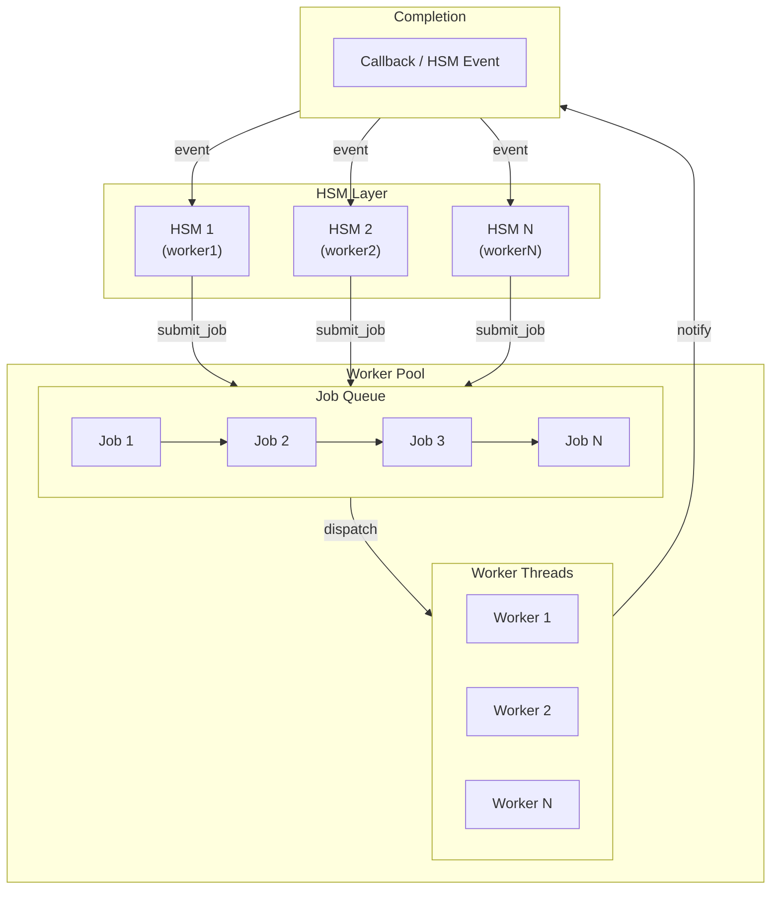
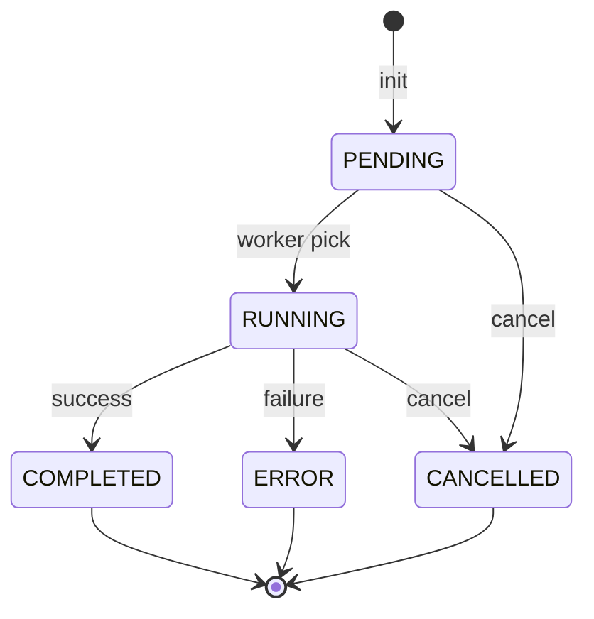
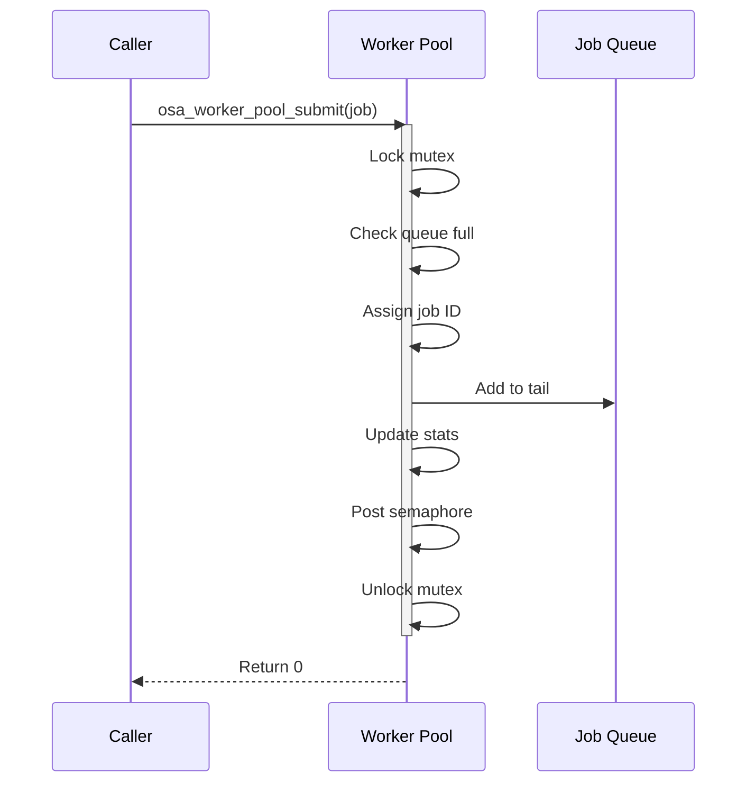
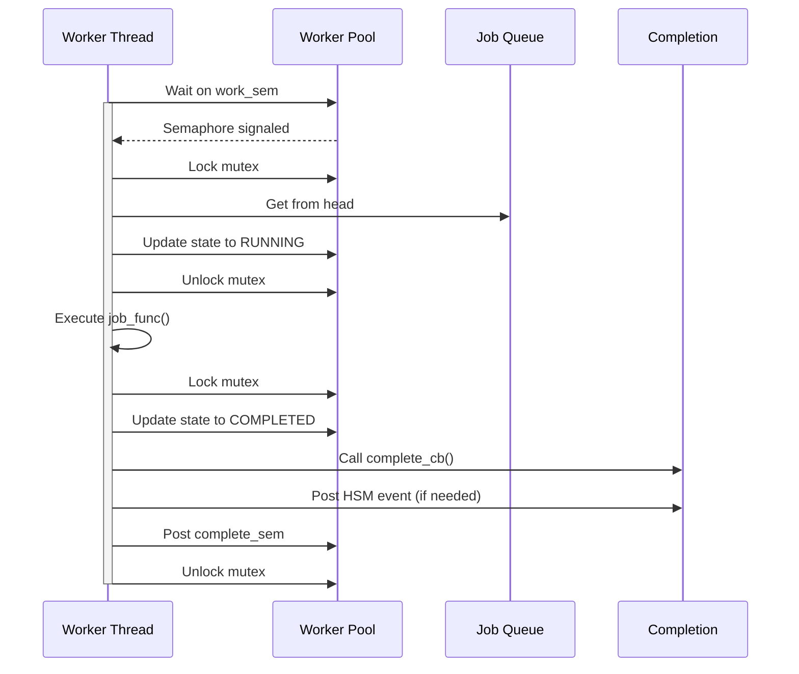
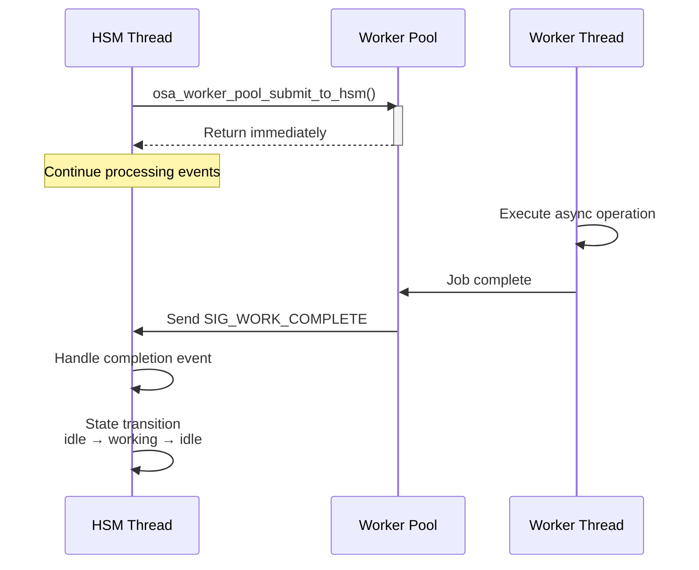

# HSM Worker Pool Design

## 1. Architecture Overview

### 1.1 Design Goals



### 1.2 Core Features

| Feature | Description |
|---------|-------------|
| **Lightweight** | Static memory pool, no dynamic allocation |
| **Configurable** | Support 1-16 worker threads |
| **HSM Integration** | Auto-send event to HSM on job completion |
| **Thread-safe** | Mutex + semaphore protection |
| **Statistics** | Submit/complete/cancel/error counts |

---

## 2. Data Structure Design

### 2.1 Job State Machine



### 2.2 Core Data Structures

```c
/* Job states */
enum osa_worker_job_state {
    OSA_JOB_PENDING,      /* Waiting for execution */
    OSA_JOB_RUNNING,      /* Currently executing */
    OSA_JOB_COMPLETED,    /* Successfully completed */
    OSA_JOB_CANCELLED,    /* Cancelled */
    OSA_JOB_ERROR,        /* Execution error */
};

/* Job item structure */
struct osa_worker_job {
    uint32_t id;                          /* Unique ID */
    enum osa_worker_job_state state;      /* Current state */

    /* Job function and context */
    int (*job_func)(void *ctx);           /* Job function */
    void *job_ctx;                        /* Job context */

    /* Completion callback */
    void (*complete_cb)(struct osa_worker_job *job, int result, void *ctx);
    void *complete_ctx;                   /* Callback context */

    /* HSM integration */
    struct osa_hsm_active *target_hsm;    /* Target HSM */
    int completion_signal;                /* Completion signal */

    int result;                           /* Execution result */
    struct osa_worker_job *next;          /* Linked list */
    struct osa_worker_job *prev;
};
```

### 2.3 Worker Pool Structure

```c
struct osa_worker_pool {
    char *name;                       /* Pool name */

    /* Worker threads */
    osa_thread_t *workers;            /* Worker thread array */
    osa_thread_t completion_thread;   /* Completion thread */

    /* Synchronization */
    osa_mutex_t lock;                 /* Mutex */
    osa_sem_t work_sem;               /* Work available semaphore */
    osa_sem_t complete_sem;           /* Completion semaphore */

    /* Job queue */
    struct osa_worker_job *job_queue_head;
    struct osa_worker_job *job_queue_tail;
    struct osa_worker_job *free_list;

    uint32_t num_workers;             /* Number of workers */
    uint32_t queue_size;              /* Queue size */
    bool shutdown;                    /* Shutdown flag */

    struct osa_worker_pool_stats stats; /* Statistics */
};
```

---

## 3. Memory Management

### 3.1 Static Job Pool

```mermaid
block-beta
    columns 8
    block:title["Static Job Pool (32 slots)"]
    end
    space
    slot0["Job 0"]:1
    slot1["Job 1"]:1
    slot2["Job 2"]:1
    slot3["..."]:1
    slot30["Job 30"]:1
    slot31["Job 31"]:1

    block:legend["Legend"]
        used["Used"]:1
        free["Free"]:1
    end

    style slot0 fill:#90EE90
    style slot1 fill:#FFB6C1
    style slot2 fill:#90EE90
    style slot30 fill:#FFB6C1
    style slot31 fill:#90EE90
    style used fill:#90EE90
    style free fill:#FFB6C1
```

**Advantages:**
- No heap allocation, no memory fragmentation
- Deterministic memory usage for embedded systems
- O(1) alloc/free time

---

## 4. Workflow

### 4.1 Job Submission Flow



### 4.2 Job Execution Flow



---

## 5. HSM Integration

### 5.1 Async Job Mode



### 5.2 State Machine Integration

```c
/* HSM state handler */
static int state_working_handler(struct my_hsm *hsm, struct hsm_event *event)
{
    struct osa_worker_job *job;

    switch (event->signal) {
    case HSM_SIG_ENTRY:
        /* Allocate and init job */
        job = osa_worker_job_alloc();
        osa_worker_job_init(job, heavy_computation, ctx, NULL, NULL);

        /* Submit with HSM notification */
        osa_worker_pool_submit_to_hsm(pool, job, hsm, SIG_WORK_COMPLETE);
        break;

    case SIG_WORK_COMPLETE:
        /* Async job complete */
        job = (struct osa_worker_job *)event->data;
        result = job->result;
        osa_worker_job_free(job);
        STATE_TRANSIT(&state_idle);
        break;
    }
}
```

---

## 6. API Reference

### 6.1 Pool Management

```c
/* Initialize worker pool */
int osa_worker_pool_init(struct osa_worker_pool *pool,
                         const char *name,
                         uint32_t num_workers,
                         uint32_t queue_size);

/* Start worker pool */
int osa_worker_pool_start(struct osa_worker_pool *pool);

/* Stop worker pool */
int osa_worker_pool_stop(struct osa_worker_pool *pool);
```

### 6.2 Job Submission

```c
/* Submit job */
int osa_worker_pool_submit(struct osa_worker_pool *pool,
                           struct osa_worker_job *job);

/* Submit with HSM notification */
int osa_worker_pool_submit_to_hsm(struct osa_worker_pool *pool,
                                  struct osa_worker_job *job,
                                  struct osa_hsm_active *target_hsm,
                                  int completion_signal);

/* Cancel pending job */
int osa_worker_pool_cancel(struct osa_worker_pool *pool, uint32_t job_id);
```

### 6.3 Job Management

```c
/* Allocate job from static pool */
struct osa_worker_job* osa_worker_job_alloc(void);

/* Free job back to pool */
void osa_worker_job_free(struct osa_worker_job *job);

/* Initialize job */
void osa_worker_job_init(struct osa_worker_job *job,
                         int (*job_func)(void *ctx),
                         void *job_ctx,
                         void (*complete_cb)(struct osa_worker_job *job, int result, void *ctx),
                         void *complete_ctx);
```

---

## 7. Configuration

| Parameter | Default | Range | Description |
|-----------|---------|-------|-------------|
| `OSA_WORKER_POOL_DEFAULT_WORKERS` | 4 | 1-16 | Default worker threads |
| `OSA_WORKER_POOL_MAX_WORKERS` | 16 | - | Max worker threads |
| `OSA_WORKER_POOL_QUEUE_SIZE` | 64 | - | Default queue size |
| `OSA_WORKER_POOL_STACK_SIZE` | 8KB | - | Thread stack size |
| `OSA_WORKER_POOL_PRIORITY` | 5 | - | Thread priority |
| `OSA_JOB_POOL_SIZE` | 32 | - | Static job pool size |

---

## 8. Test Results

### 8.1 Unit Test

```
=== Worker Pool Test ===

[wp|core] Worker pool 'test_pool' initialized with 2 workers, queue size 16
[wp|core] Worker thread started
[wp|core] Worker thread started
[wp|core] Worker pool 'test_pool' started with 2 workers
Worker pool started with 2 workers

Submitting 5 job items...
[wp|core] Job id:1 submitted, queue depth:1
Submitted job 1 (id=1)
...

=== Statistics ===
Submitted:  5
Completed:  5
Cancelled:  0
Errors:     0
Queue:      0
Active:     0

Job count: 5
[wp|core] Worker pool stopped

=== Test Complete ===
```

### 8.2 Verification Checklist

- [x] Pool init/start/stop
- [x] Concurrent job execution
- [x] Queue management
- [x] Completion callback
- [x] Statistics accuracy
- [x] Resource cleanup

---

## 9. File Structure

```
core/
├── osa_worker.h        # Worker pool header
├── osa_worker.c        # Worker pool implementation

example_linux/
├── hsm_threadpool_example.c  # HSM integration example
├── threadpool_test.c         # Unit test
└── makefile                  # Build config

docs/
└── worker_design.md          # This document
```

---

## 10. Usage Examples

### 10.1 Basic Usage

```c
#include "osa_worker.h"

int my_job_func(void *ctx)
{
    int *data = (int *)ctx;
    do_heavy_work(*data);
    return 0;
}

void example(void)
{
    struct osa_worker_pool pool;
    struct osa_worker_job job;
    int my_data = 42;

    /* 1. Init and start */
    osa_worker_pool_init(&pool, "my_pool", 4, 64);
    osa_worker_pool_start(&pool);

    /* 2. Init job */
    osa_worker_job_init(&job, my_job_func, &my_data, NULL, NULL);

    /* 3. Submit */
    osa_worker_pool_submit(&pool, &job);

    /* 4. Wait */
    osa_worker_pool_wait(&pool, &job, -1);

    /* 5. Stop */
    osa_worker_pool_stop(&pool);
}
```

### 10.2 HSM Integration

```c
static int state_idle_handler(struct my_hsm *hsm, struct hsm_event *event)
{
    struct osa_worker_job *job;

    switch (event->signal) {
    case SIG_START_ASYNC:
        job = osa_worker_job_alloc();
        osa_worker_job_init(job, async_op, hsm, NULL, NULL);
        osa_worker_pool_submit_to_hsm(pool, job, hsm, SIG_WORK_DONE);
        STATE_TRANSIT(&state_waiting);
        break;
    }
}

static int state_waiting_handler(struct my_hsm *hsm, struct hsm_event *event)
{
    struct osa_worker_job *job;

    switch (event->signal) {
    case SIG_WORK_DONE:
        job = (struct osa_worker_job *)event->data;
        process_result(job->result);
        osa_worker_job_free(job);
        STATE_TRANSIT(&state_idle);
        break;
    }
}
```

---

## 11. Summary

This worker pool design provides:

1. **Lightweight** - Static memory pool, no dynamic allocation
2. **HSM Integration** - Async job completion auto-notifies HSM
3. **Flexible** - Support 1-16 worker threads
4. **Complete** - Submit, cancel, wait, statistics
5. **Thread-safe** - Robust synchronization
6. **Easy to use** - Clean API design

Suitable for embedded applications requiring async operations in HSM framework.
